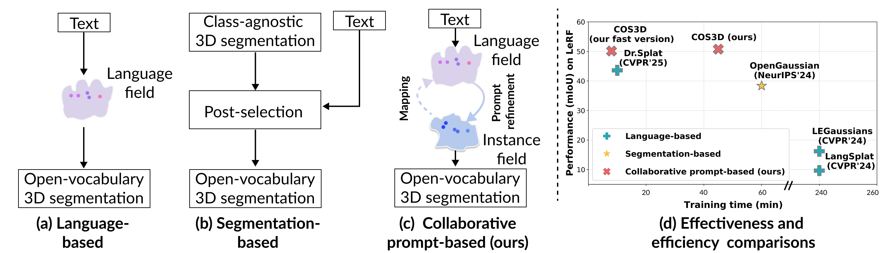
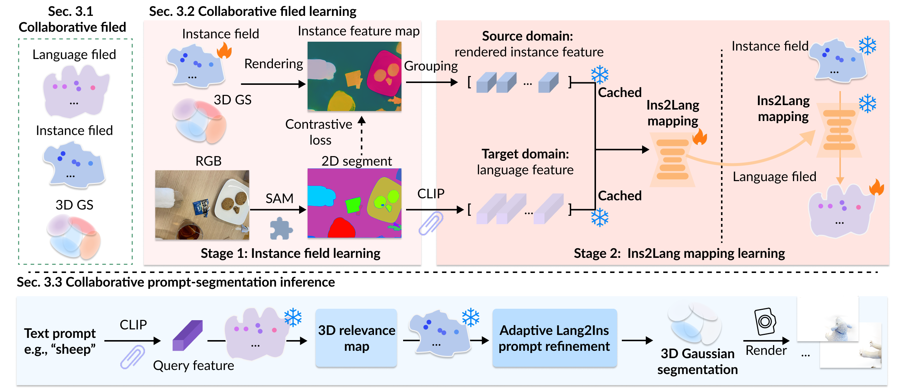
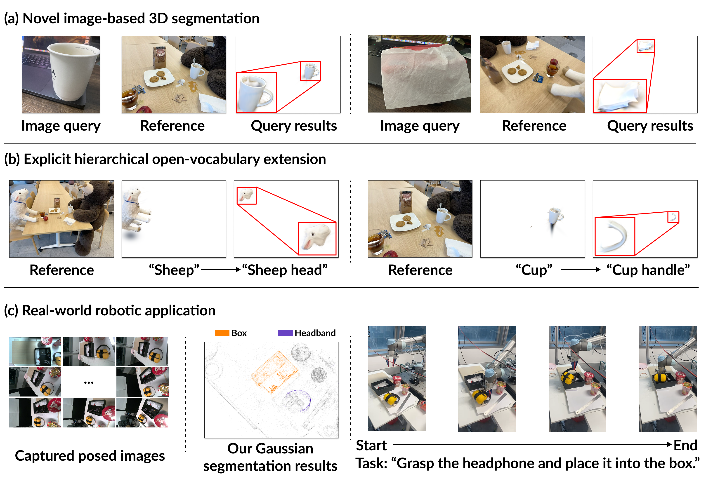

# COS3D: Collaborative Open-Vocabulary 3D Segmentation

This is the official PyTorch implementation of the following publication:

> **COS3D: Collaborative Open-Vocabulary 3D Segmentation**<br/>
> Runsong Zhu, Ka-Hei Hui, Zhengzhe Liu, Qianyi Wu, Weiliang Tang, Shi Qiu, 
Pheng-Ann Heng, Chi-Wing Fu.<br/>
> *NeurIPS 2025*<br/>
> [**Paper (NeurIPS)**](https://openreview.net/pdf/06aa29f44284f6d2d58d568ceb4caf7bd0e9a244.pdf) |[**Paper (ArXiv)**](https://arxiv.org/abs/2510.20238) 

## Introduction

<p align="center">
<strong>TL;DR: 

1). This paper contributes a novel and effective collaborative prompt-segmentation framework (COS3D) for the 3D open-vocabulary segmentation task.

2). Extensive experiments demonstrate that 
  i) it not only significantly outperforms existing baselines with superior training efficiency 
  ii) but also shows high potential for various applications, such as novel image-based 3D segmentation, hierarchical segmentation, and robotics.</strong>
</p>

### Teaser

### Overview

### Applications



## Requirements

The code has been tested on:
- Ubuntu 20.04
- CUDA 11.8
- Python 3.8.18
- Pytorch 1.12.1
- GeForce RTX 4090.

## Installation

### Cloning the Repository

The repository contains submodules, thus please check it out with 
```shell
# HTTPS
git https://github.com/Runsong123/COS3D.git --recursive
```

### Environment Setup

Our default, provided install method is based on Conda package and environment management:
```shell
conda env create --file environment.yml
conda activate COS3D
```
Then, download the checkpoints of SAM from [here](https://github.com/facebookresearch/segment-anything) and place it in the ```ckpts/``` directory.

## Pre-processing:

1. Downloading/Preparing the dataset (images + segmentation/Language features via a 2D foundation model).
2. (Pre-processing) obtaining the 3DGS from the given images.

## Training

Our training process consists of two steps:

1. Stage 1: Training instance field.
2. Stage 2: Instance2language mapping.


### For simplicity, you can run the following training script:

```shell
cd ./script/train && bash train.sh

```

## Inference

Our inference process consists of three main steps:

1. 3D grounding for given queries.
2. Render images for novel views.
3. Exporting the metrics.

### For simplicity, you can run the following inference script:
``` shell
cd ./script/infer && bash infer.sh
```

## Data and checkpoint

You can download the LERF dataset from this [**OneDrive**](https://onedrive.live.com/?authkey=%21AIgsXZy3gl%5FuKmM&id=744D3E86422BE3C9%2139815&cid=744D3E86422BE3C9) / [Baidu](https://pan.baidu.com/s/1B_tGYla5dWyJRu3jTNTMvA?pwd=u5iy) (provided by OpenGaussians). Additionally, we provide our COS3D [checkpoint](https://mycuhk-my.sharepoint.com/:u:/g/personal/1155183723_link_cuhk_edu_hk/EUYQ9Qs9kYtMtKjCaJ9EIKcBwMvyfgQegQ2Xkty7CiiJ8g?e=KWsHJQ) for quick testing.


## TODO list

- [x] Release training code
- [x] Release evaluation code
- [ ] Release the preprocessing code to support various 2D foundation models (e.g., SAM2 and Semantic-SAM for segmentation results, and SigLIP for language features).
- [ ] Release the applications code  (e.g., novel image-based query).

This repository is still under construction. Please feel free to open issues or submit pull requests. We appreciate all contributions to this project.

## Citation

```
@article{zhu2025cos3d,
  title={COS3D: Collaborative Open-Vocabulary 3D Segmentation},
  author={Zhu, Runsong and Hui, Ka-Hei and Liu, Zhengzhe and Wu, Qianyi and Tang, Weiliang and Qiu, Shi and Heng, Pheng-Ann and Fu, Chi-Wing},
  journal={arXiv preprint arXiv:2510.20238},
  year={2025}
}

```

## Related Projects
Some code snippets are borrowed from [OpenGaussian](https://github.com/yanmin-wu/OpenGaussian), [Langsplat](https://github.com/minghanqin/LangSplat), [GAGS](https://github.com/WHU-USI3DV/GAGS), [Unified-Lift](https://github.com/Runsong123/Unified-Lift). We thank the authors for releasing their code. 